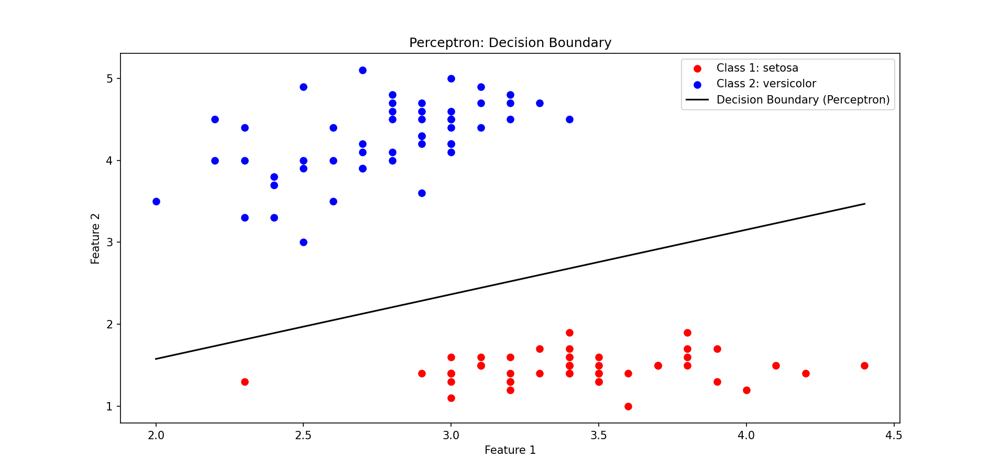

# Iris Binary Classification - Perceptron & Adaboost

## Overview
This project presents solutions for three main tasks in **Machine Learning**, as part of the **Ariel University** course, 2024B semester. 

The assignment explores the following:
1. **Perceptron Algorithm Implementation & Evaluation**
2. **Adaboost Algorithm with Custom Hypothesis Set**

The project includes code, analysis, and visualizations for each task.

---
## Dataset - Scatter Plot


---

## Perceptron Algorithm

### Dataset
- **UCI Iris Dataset** (focusing on the **2nd** and **3rd** features).

### Implemented Algorithm
- **Perceptron Algorithm** without normalizing vectors.

### Experiments
We trained and evaluated the algorithm on the following class pairs:

#### 1. Setosa vs. Versicolor

- **Final Weights Vector**: `[-5.2, 4.1]`
- **Number of Mistakes**: `5`

#### 2. Setosa vs. Virginica

- **Final Weights Vector**: `[-3.2, 3.7]`
- **Number of Mistakes**: `3`

#### 3. Versicolor vs. Virginica (Hypothesis)

- Perceptron **fails** due to the **lack of linear separability**.
- **Explanation**: The data points cannot be separated by a straight line, causing the Perceptron to never converge.

### Key Insights
- Larger margins lead to fewer mistakes.
- Non-linearly separable data makes Perceptron ineffective.

---

## Adaboost Algorithm

### Dataset
- Versicolor and Virginica classes from the Iris dataset.

### Implemented Algorithm
- **Adaboost** using **lines passing through any two points** as hypotheses.

### Experiment Setup
- Split data into **50% train** and **50% test** sets.
- Run Adaboost on the **training set** to select the top **8** hypotheses and corresponding weights.
- Evaluate **empirical error** and **true error** for each `k=1,…,8`.
- Execute the above **100 times** and average the results.

### Key Findings
- **Empirical error** decreases with each additional hypothesis, indicating better fit on training data.
- **True error** plateaus, showing potential **overfitting**.
- Beyond a certain point (around `k=3`), the improvement in **test error** stagnates.

### Results Visualization

---

## Running the Project
To execute the project, simply run:
```sh
python main.py
```
### Execution Flow:
1. Runs **Perceptron** and outputs results (prints and plots graphs).
2. Runs **Adaboost**, prints results, and visualizes the tree.

---

## Conclusion
This project demonstrates the theoretical and practical implementation of:
- **VC-Dimension Analysis**
- **Perceptron Algorithm**: Evaluated on different Iris class pairs with margin insights.
- **Adaboost Algorithm**: Analyzed over multiple runs with error evaluation on both training and test sets.

### Final Insights
- Perceptron works well for **linearly separable** data.
- Adaboost is powerful but prone to **overfitting** without careful selection of weak hypotheses.
